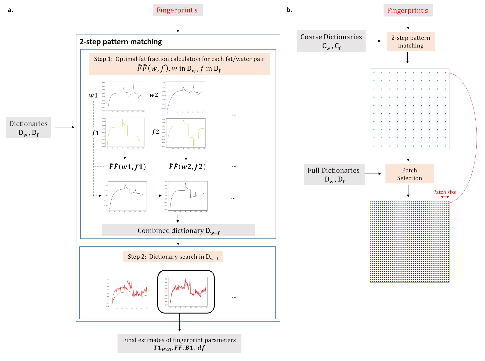

# 2D MRF Fingerprinting using bicomponent dictionary matching

Bicomponent dictionary matching for fast reconstruction of quantitative maps from Siemens raw data ([[1]](#1)).

<figure>
  
  <figcaption><i>Figure 1: a. Bicomponent dictionary matching framework - b. Clustering </i></figcaption>
</figure>

## Requirements

After cloning the repository, one should create a conda environment using the environment.yml.
```
conda env create --name <env> --file environment.yml
conda activate <env>
```

## Data

Example raw data can be pulled using:

```
python pull_example_data.py
```


The processing uses several stages.

### 1. Data extraction

If using the example raw data: 
```
python main_functions_2D.py extract_data --filename data/meas_MID00078_FID221413_T1_mapping.dat
```


### 2. Coil sensitivities calculation

```
python main_functions_2D.py calculate_sensi --filekdata data/kdata.npy
```

### 3. Time serie of undersampled volumes reconstruction

```
python main_functions_2D.py build_volumes --filekdata data/kdata.npy --fileb1 data/b1.npy
```


### 4. Mask reconstruction

```
python main_functions_2D.py build_masks --filekdata data/kdata.npy --fileb1 data/b1.npy
```

### 5. Parametric Maps reconstruction with pixelwise fitting of the timeserie of volumes on the dictionary

That is where bicomponent dictionary matching is used. 
```
python main_functions_2D.py build_maps --filevolumes data/volumes.npy --filemasks data/masks.npy --fileseq data/dico_seqParams.pkl --dictfiles dico/mrf_dictconf_Dico2_Invivo_TR1.11_reco5.0.pkl
```

If no dictionary for the sequence exists, the dictionary (dico/mrf_dictconf_Dico2_Invivo_TR1.11_reco5.0.pkl in the example above) should be built for the specific dictionary grids, sequence acquisition parameters, echo spacing and recovery time of the acquired data using:

```
python main_functions_2D.py generate_dico --sequencefile dico/mrf_sequence_adjusted.json --dictconf dico/mrf_dictconf_Dico2_Invivo.json --dictconflight dico/mrf_dictconf_Dico2_Invivo_light_for_matching.json --reco 5.0 --echospacing 1.11 --TI 8.32
```

## References
<a id="1">[1]</a> 
Slioussarenko C, Baudin P, Reyngoudt H, Marty B. Bi‐component dictionary matching for MR fingerprinting for efficient quantification of fat fraction and water T1 in skeletal muscle. Magnetic Resonance in Med. March 2024:mrm.29901. doi:10.1002/mrm.29901
